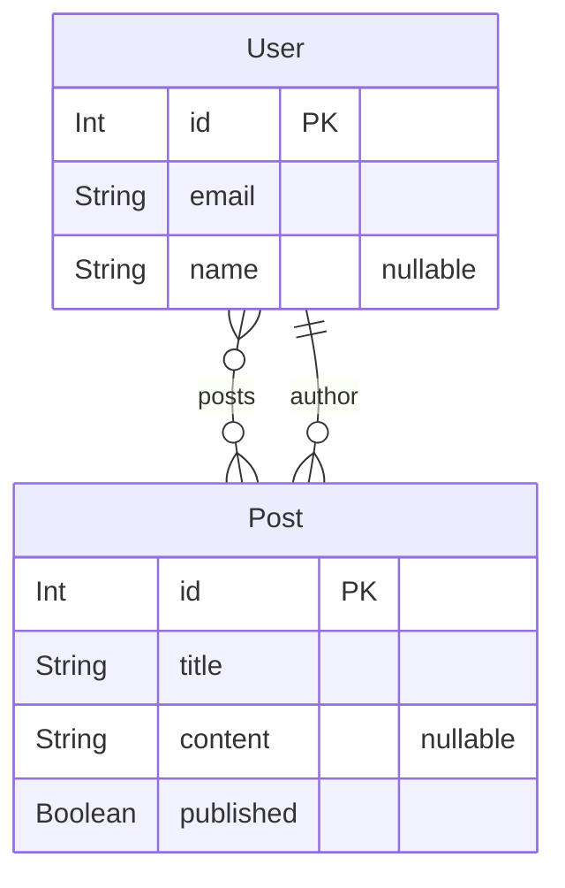

```mermaid
erDiagram

  User {
    Int id PK
    String email  
    String name  "nullable"
    }
  

  Post {
    Int id PK
    String title  
    String content  "nullable"
    Boolean published  
    }
  
    User o{--}o Post : "posts"
    Post o{--|| User : "author"
```
